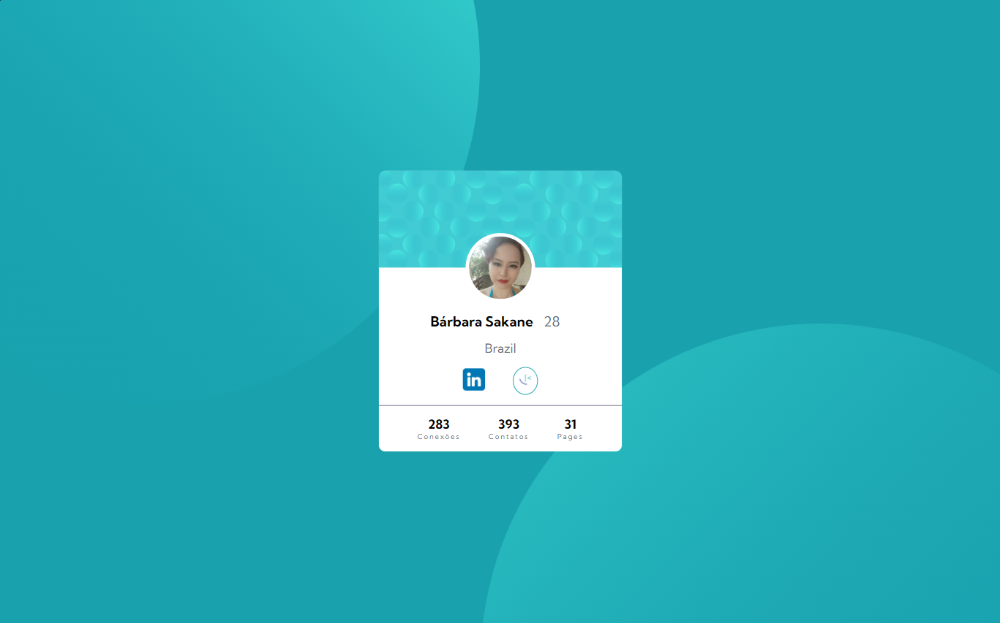

## Table of contents

- [Overview](#overview)
  - [Screenshot](#screenshot)
  - [Links](#links)
- [Author](#author)
- [Acknowledgments](#acknowledgments)

## Overview
Profile Card Design using HTML and CSS
This is a solution to the [Profile card component challenge on Frontend Mentor](https://www.frontendmentor.io/challenges/profile-card-component-cfArpWshJ).

### Screenshot

Desktop

Mobile

### Links

- Solution URL: [Add solution URL here](https://www.frontendmentor.io/solutions/profile-card-design-using-html-and-css-W82AJCw-y7)
- Live Site URL: [Add live site URL here](https://skne.github.io/Profile-Card-Design-using-HTML-and-CSS/)

### Built with
- Semantic HTML5 markup
- CSS custom properties
- Flexbox

## Author

- Linkedin - [Bárbara Sakane](https://www.linkedin.com/in/barbarasakane/)
- Frontend Mentor - [@skne](https://www.frontendmentor.io/profile/skne)
